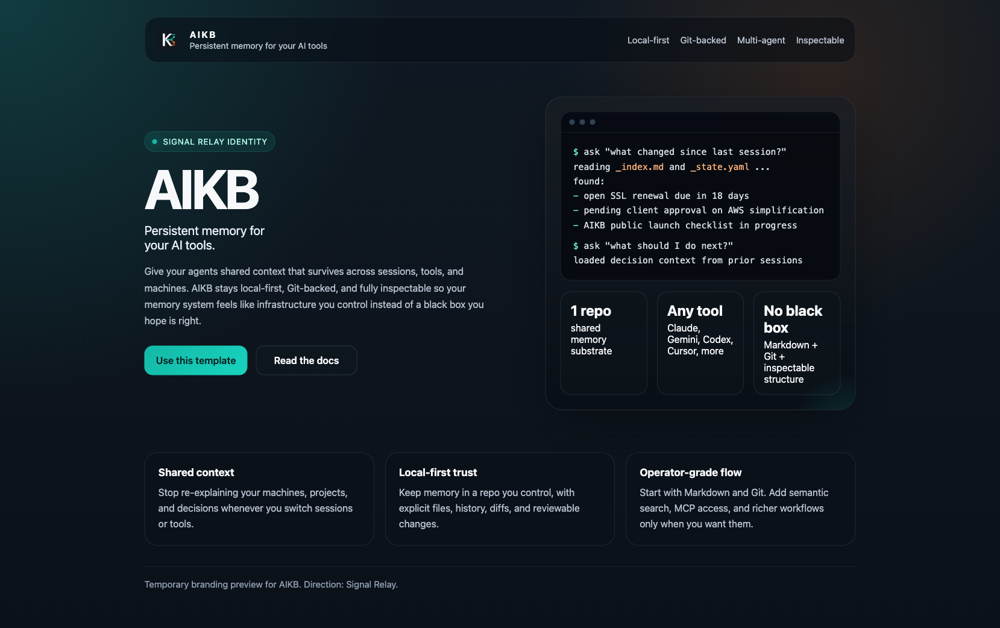

<p align="center">
  
</p>

<h1 align="center">AIKB — AI Knowledge Base</h1>

<p align="center">
  <strong>Persistent memory for your AI tools.</strong>
</p>

<p align="center">
  Shared context across sessions, tools, and machines.
</p>

<p align="center">
  
  
  
  
</p>

---

### Persistent memory for your AI tools.

AIKB gives your agents shared context that survives across sessions, tools, and machines. It stays local-first, Git-backed, and fully inspectable, so your memory system feels like infrastructure you control instead of a black box you hope is right.

> Your AI tools should not start from zero.

[**Get Started**](#quick-start) • [**How It Works**](#how-it-works) • [**Tool Support**](#ai-tool-compatibility)

---

## Why AIKB

Every AI session starts from zero. You re-explain your projects, your stack, your preferences, and your constraints every time. Context windows are finite, sessions end, and the useful working memory disappears with them.

If you use multiple tools, the problem gets worse. Claude, Gemini, Codex, Cursor, ChatGPT, and web copilots all end up relearning the same context from scratch.

## The Solution

AIKB is a structured knowledge base stored in a private GitHub repo. Your agents read it at the start of a session to orient themselves, and write back to it when they learn something durable. The result is memory that stays inspectable, portable, and under your control.

```text
Session starts → Agent reads AIKB → Agent knows everything
Session ends   → Agent writes updates → Next session picks up where this one left off
```

---

## Key Features

- **Shared context across tools** — one memory layer for Claude Code, Gemini CLI, Codex, Cursor, ChatGPT, and more
- **Local-first and Git-backed** — durable memory in files you can inspect, diff, sync, and own
- **Two access modes** — local clone for speed, or GitHub MCP for remote sessions and new machines
- **Semantic search** — optional `aikb_search` MCP tool for natural-language queries across your knowledge base
- **Layered loading** — agents read only what they need, preserving context window budget
- **Checkpoint commits** — agents can save progress during long sessions so memory survives interruptions
- **Secrets-safe** — credentials stay in your secrets manager; AIKB stores references only
- **Machine-aware** — each machine gets a profile so the agent uses the right paths, tools, and conventions

## Product Snapshot

| What it gives you | Why it matters |
|-------------------|----------------|
| Persistent session memory | Stop repeating the same setup and project context |
| Inspectable storage | Trust the memory because it lives in Markdown + Git |
| Cross-tool continuity | Switch tools without losing your working context |
| Structured updates | Capture decisions, gotchas, blockers, and state changes cleanly |

## Visual Preview

Brand direction: `Direction A / Mineral Cobalt`

<p align="center">
  
</p>

See [`_branding/identity.md`](_branding/identity.md) for the active brand system and [`preview/index.html`](preview/index.html) for the temporary landing mock.

---

## AI Tool Compatibility

| Tool | Integration | AIKB Access Mode |
|------|-------------|-----------------|
| Claude Code | `~/.claude/CLAUDE.md` auto-loaded | Local clone or GitHub MCP |
| Gemini CLI | `~/.gemini/GEMINI.md` auto-loaded | Local clone or GitHub MCP |
| Codex CLI | `AGENTS.md` in project root | Local clone (or MCP if configured) |
| Cursor | User Rules (Settings UI) | Local clone |
| ChatGPT | Custom Instructions (Settings UI) | Manual paste at session start |
| Google Gemini | Custom Instructions (Settings UI) | Manual paste at session start |
| Grok | Customise Grok (Settings UI) | Manual paste at session start |

---

## Quick Start

**Prerequisites:** Git, a GitHub account, and at least one AI tool.

### 1. Create your private AIKB repo

Click **[Use this template](../../generate)** → name it `AIKB` → set it to **Private**.

Or from the CLI:
```bash
gh repo create AIKB --template mcglothi/ai-knowledge-base --private --clone
cd AIKB
```

### 2. Run the setup script

```bash
chmod +x install.sh
./install.sh
```

The script will ask for your GitHub username, repo name, and preferred local path, then generate personalized agent instruction files.
If you cloned from your own GitHub repo first, it auto-detects the GitHub username and repo name from `origin`, so most people can accept the defaults.

### 3. Configure your primary AI tool

Follow the guide for your tool in [`_agents/README.md`](_agents/README.md):

- **Claude Code** — copy `_agents/claude-code.md` to `~/.claude/CLAUDE.md`
- **Gemini CLI** — copy `_agents/gemini-cli.md` to `~/.gemini/GEMINI.md`
- **Codex CLI** — copy `_agents/codex.md` to `AGENTS.md` in each Codex project repo
- **Cursor** — paste `_agents/cursor.md` into Settings → Cursor Settings → Rules → User Rules
- **ChatGPT / Gemini / Grok** — paste the relevant file into Custom Instructions

### 4. Fill in your personal files

`install.sh` creates these files automatically — they just need your details:

- `personal/profile.md` — your background, skills, and communication preferences
- `personal/dev-environment/README.md` — your machine inventory (hostnames, OS, code roots)
- `personal/dev-environment/<hostname>.md` — installed tools on your primary machine

The `example/` directory has annotated examples showing what good entries look like.

### 5. (Optional) Set up semantic search

Run one command to enable natural language queries across all your AIKB files:

```bash
bash _tools/aikb-search/setup.sh
```

After setup, your agent can answer questions like "what's currently broken?" or "what SSL certs expire soon?" without you having to know which file to load. See [`docs/search-setup.md`](docs/search-setup.md) for details.

### 6. Start a session

Launch your AI tool. It will read AIKB and immediately know who you are, what machines you use, and what you're working on.

### On a new machine

Clone your private AIKB repo and run `install.sh` again. It detects the new hostname, scaffolds a machine profile for it, and sets up your AI tools — your existing personalization is already in the repo, no re-entering needed.

---

## Staying Up to Date

When improvements are made to the template (better agent instructions, new tool support, updated schemas), you can pull them without touching your personal content.

`install.sh` automatically adds this repo as an `upstream` git remote and saves your personal config to a git-ignored `.aikb-config.d/` directory. When you want updates, run:

```bash
./sync.sh
```

`sync.sh` will:
1. Fetch the latest changes from upstream
2. Show you exactly what changed in the framework dirs (`_agents/`, `_templates/`, `docs/`)
3. Ask for confirmation before applying anything
4. Re-apply your personal values (username, repo name, paths, secrets manager) automatically
5. Re-copy to `~/.claude/CLAUDE.md` or `~/.gemini/GEMINI.md` if you set those up during install
6. Commit the result

**What gets updated:** `_agents/`, `_templates/`, `_tools/`, `docs/`, `sync.sh`, `install.sh`, `.gitignore`

**What is never touched:** `_index.md`, `_state.yaml`, `personal/`, `projects/`, `work/`, and any other dirs you've created

---

## How It Works

### Repository structure

```text
AIKB/
├── README.md                  ← Human-readable overview (you're reading it)
├── _index.md                  ← One-line status for every project (agents read this first)
├── _state.yaml                ← Time-sensitive surface: SSL expiry, incidents, recent changes
├── _agents/                   ← Instruction files for every AI tool
│   ├── README.md              ← Setup steps and comparison table
│   ├── claude-code.md         ← Source of truth for ~/.claude/CLAUDE.md
│   ├── gemini-cli.md          ← Source of truth for ~/.gemini/GEMINI.md
│   ├── codex.md               ← Source of truth for repo-level AGENTS.md
│   ├── cursor.md              ← Paste into Cursor User Rules
│   ├── chatgpt.md             ← Paste into ChatGPT Custom Instructions
│   ├── gemini.md              ← Paste into Gemini Custom Instructions
│   ├── grok.md                ← Paste into Grok Customise Grok
│   ├── active.md              ← Live session presence (agents register here)
│   └── registry.md            ← Per-tool capability notes for multi-agent sessions
├── _templates/                ← Blank templates for new files
├── personal/                  ← Your profile, machines, and dev environments
├── projects/                  ← Your coding projects
├── work/                      ← Work context (non-sensitive)
└── [your-domain]/             ← Add folders for home lab, clients, etc.
```

### The reading protocol (what agents do)

Agents follow a layered loading strategy to avoid blowing the context window:

1. **Read `_index.md`** — one row per project/system, quick orientation
2. **Read `_state.yaml`** — time-sensitive items (SSL expiry, open incidents, pending tasks)
3. **Load specific files** only when the task requires them

This means a session about Project A never loads Project B's files. Context budget is preserved for actual work.

### The writing protocol (how agents update AIKB)

Agents update AIKB when they learn something useful for future sessions:
- A system's state changed
- A decision was made (and the rationale should be preserved)
- A gotcha or pitfall was discovered
- A task was completed or a new one identified

Updates go directly into the relevant file (no append-only corrections), followed by a commit and push. Mid-session checkpoint commits are encouraged.
