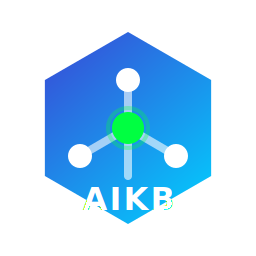

<h1 align="center">AIKB — Master Index</h1>

<i>Unified memory for the agentic era.</i>

---

**Last Updated:** 2026-03-04
**Purpose:** Single-read orientation for AI agents. One row per project/system with current status. Load the linked file for full details — never bulk-load files that aren't relevant to the current task.

---

## Personal

| Topic | Status | Tags | Details |
|-------|--------|------|---------|
| Profile | ⬜ Fill in | profile, skills, background, bio, pricing | [`personal/profile.md`](personal/profile.md) |
| Dev environments | ⬜ Fill in | machines, paths, tools, homebrew, python, shell | [`personal/dev-environment/README.md`](personal/dev-environment/README.md) |

---

## Projects

| Project | Status | Tags | Details |
|---------|--------|------|---------|
| *(no projects yet)* | — | — | — |

---

## Work

| Topic | Status | Tags | Details |
|-------|--------|------|---------|
| *(no entries yet)* | — | — | — |

---

## Open Items Across All Projects

| Item | Project | File |
|------|---------|------|
| *(none)* | — | — |

---

<!--
HOW TO ADD AN ENTRY:

1. Add a row to the relevant domain table.
2. Use descriptive tags (lowercase, hyphenated) that match how you'd search for this project.
3. Link to the project file.
4. Update this file and _state.yaml in the same commit.

Example row:
| My Project | 🟢 Active | myproject, python, api, postgres | [`projects/my-project.md`](projects/my-project.md) |
-->
