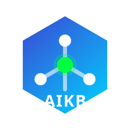

<h1 align="center">AIKB — Master Index</h1>

<i>Unified memory for the agentic era.</i>

---

**Last Updated:** 2026-04-30
**Purpose:** Single-read orientation for AI agents. One row per project/system with current status. Load the linked file for full details — never bulk-load files that aren't relevant to the current task.

---

## 👤 Personal

| Topic | Status | Tags | Details |
|-------|--------|------|---------|
| Profile | 🟢 Active | profile, skills, background, unix, ansible, llbean | [`personal/profile.md`](personal/profile.md) |
| User Preferences | 🟢 Active | tech-stack, tools, formatting, communication | [`personal/PREFERENCES.md`](personal/PREFERENCES.md) |
| **Deep Context (TELOS)** | 🟢 Active | mission, goals, beliefs, models, strategies, learned, narratives, ideas, challenges, context | [`personal/TELOS/MISSION.md`](personal/TELOS/MISSION.md) |
| DA Identity: Kyloch | 🟢 Active | persona, voice, identity, assistant, tone, kyloch, jarvis-alias | [`personal/DAIDENTITY.md`](personal/DAIDENTITY.md) |
| Visionary Goals | 🟢 Active | vision, goals, ideas | [`personal/vision.md`](personal/vision.md) |
| AI Services Business | 🔬 Planning | ai, consulting, monetization, local-business, maine, pricing, llm, private-ai, services | [`personal/ai-services-business.md`](personal/ai-services-business.md) |
| Dev environments | 🟢 Active | machines, paths, tools, python, shell, wsl2 | [`personal/dev-environment/README.md`](personal/dev-environment/README.md) |
| J9RC8S3-LP (work laptop) | 🟢 Active | work-laptop, ubuntu, wsl2, ansible | [`personal/dev-environment/J9RC8S3-LP.md`](personal/dev-environment/J9RC8S3-LP.md) |
| feynman (desktop) | 🟢 Active | feynman, arch-linux, desktop, workstation | [`personal/dev-environment/feynman.md`](personal/dev-environment/feynman.md) |
| tesla (linux) | 🟢 Active | tesla, linux | [`personal/dev-environment/tesla.md`](personal/dev-environment/tesla.md) |
| mbp-i9 | 🟢 Active | mbp, macos, intel | [`personal/dev-environment/mbp-i9.md`](personal/dev-environment/mbp-i9.md) |
| mbp-m1 | 🟢 Active | mbp, macos, apple-silicon | [`personal/dev-environment/mbp-m1.md`](personal/dev-environment/mbp-m1.md) |
| latitude-5520 | 🟢 Active | latitude, dell, linux | [`personal/dev-environment/latitude-5520.md`](personal/dev-environment/latitude-5520.md) |
| newton (MBP M-series) | 🔬 Planning | newton, macbook-pro, apple-silicon, bootstrap | [`personal/dev-environment/newton.md`](personal/dev-environment/newton.md) |

---

## 🏗️ Projects

| Project | Status | Tags | Details |
|---------|--------|------|---------|
| Zscaler Training Platform | 🟢 Active | zscaler, zpa, zia, training, nginx, podman, inf-dv-tim01 | [`projects/zscaler-training.md`](projects/zscaler-training.md) |
| Dream Vault (Somnium / Remnant) | 🔨 Designing | dreams, ai, local-llm, privacy, box, hardware, astrology, cultures | [`projects/dream-vault.md`](projects/dream-vault.md) |
| AIKB Knowledge Graph | 🔨 In Progress | aikb, knowledge-graph, retrieval, graph | [`projects/aikb-knowledge-graph.md`](projects/aikb-knowledge-graph.md) |

---

## 🧪 Personal Projects

| Project | Status | Tags | Details |
|---------|--------|------|---------|
| Project Kyloch (personal AI) | 🔨 In Progress | kyloch, jarvis-alias, personal-ai, local-llm, frontier-api, voice, home-assistant, aikb, vision | [`personal-projects/project-kyloch.md`](personal-projects/project-kyloch.md) |
| Kyloch Architecture | 🔨 In Progress | kyloch, architecture, runtime-fabric, voice, hopper, turing, aikb, stt, tts | [`personal-projects/kyloch-architecture.md`](personal-projects/kyloch-architecture.md) |
| Kyloch Implementation Roadmap | 🔨 In Progress | kyloch, roadmap, implementation, hopper, turing, aikb | [`personal-projects/kyloch-implementation-roadmap.md`](personal-projects/kyloch-implementation-roadmap.md) |
| AIKB Implementation Roadmap | 🔨 In Progress | aikb, roadmap, memory, retrieval, graph, governance, memory-core | [`personal-projects/aikb-implementation-roadmap.md`](personal-projects/aikb-implementation-roadmap.md) |
| AIKB Runtime Memory Upgrade | 🔨 In Progress | aikb, memory, runtime-memory, ingestion, promotion-pipeline, governance | [`personal-projects/aikb-memory-runtime-upgrade.md`](personal-projects/aikb-memory-runtime-upgrade.md) |
| AIKB Memory Retrieval + Scoring | 🟢 Active | aikb, memory, retrieval, scoring, ranking, conflicts | [`personal-projects/aikb-memory-retrieval-scoring.md`](personal-projects/aikb-memory-retrieval-scoring.md) |
| AIKB Memory Metadata Contract | 🔬 Planning | aikb, memory, metadata, schema, governance, retrieval | [`personal-projects/aikb-memory-metadata-contract.md`](personal-projects/aikb-memory-metadata-contract.md) |
| AIKB Temporal Preference Memory | 🔬 Planning | aikb, memory, temporal, preferences, retrieval, ranking | [`personal-projects/aikb-temporal-preference-memory.md`](personal-projects/aikb-temporal-preference-memory.md) |
| AIKB LoRA Integration | 🔬 Planning | lora, fine-tuning, peft, mlx, unsloth, ollama | [`personal-projects/aikb-lora-integration.md`](personal-projects/aikb-lora-integration.md) |
| AIKB Bootstrap Site | 🟢 Active | aikb-bootstrap, aikb.timmcg.net, firebase-hosting, bootstrap, docs | [`personal-projects/aikb-bootstrap.md`](personal-projects/aikb-bootstrap.md) |
| Goose-AIKB Integration | ✅ Built | goose, aikb, mcp, automation, orchestration, recipes | [`personal-projects/goose-aikb-integration.md`](personal-projects/goose-aikb-integration.md) |
| OpenSoak (hot tub controller) | 🟢 Active | opensoak, raspberry-pi, fastapi, vite, hot-tub, authentik, nginx | [`personal-projects/opensoak.md`](personal-projects/opensoak.md) |
| Cliparr | ⚠️ In Progress | cliparr, coupons, browser-extension, truenas, playwright, mv3 | [`personal-projects/cliparr.md`](personal-projects/cliparr.md) |
| LapTime | 🔨 In Progress | laptime, local-llm, benchmarks, simulator, hardware, affiliate | [`personal-projects/laptime.md`](personal-projects/laptime.md) |
| Runway | 🔨 Building | runway, ai-tools, quota, tracking, electron, macos, menu-bar | [`personal-projects/runway.md`](personal-projects/runway.md) |
| onWatch | ✅ Built | distributed-quota, monitoring, agents, golang, bridge | [`personal-projects/onwatch.md`](personal-projects/onwatch.md) |
| Landing Page (timmcg.net) | 🟢 Live | timmcg.net, landing-page, firebase, gcp, react, vite, cloudflare | [`personal-projects/timmcg-landing.md`](personal-projects/timmcg-landing.md) |
| Headscale on GCP | 🟢 Active | headscale, vpn, gcp, tailscale, networking, derp | [`personal-projects/headscale-gcp.md`](personal-projects/headscale-gcp.md) |
| Pixel Android (remote control) | 🟢 Active | pixel, android, adb, wireless-adb, tailscale | [`personal-projects/pixel-android.md`](personal-projects/pixel-android.md) |
| ChatOps On-The-Go | 🔨 In Progress | chatops, telegram, on-the-go, mobile, wear-os, pixel-fold | [`personal-projects/chatops-on-the-go.md`](personal-projects/chatops-on-the-go.md) |
| Pixel Watch Voice Memo Capture | 🔬 Planning | pixel-watch, wear-os, voice, memo, telegram, sideload | [`personal-projects/pixel-watch-voice-memo.md`](personal-projects/pixel-watch-voice-memo.md) |
| Security Agents with Shannon | 🔬 Planning | security-agents, shannon, pentest, appsec, homelab, defensive-security | [`personal-projects/security-agents-shannon.md`](personal-projects/security-agents-shannon.md) |
| Newton Workstation Bootstrap | 🔬 Planning | newton, macbook-pro, bootstrap, apple-silicon, local-llm | [`personal-projects/newton-workstation-bootstrap.md`](personal-projects/newton-workstation-bootstrap.md) |
| Newton Model Strategy | 🔬 Planning | newton, local-llm, model-routing, ollama, llama.cpp, mlx | [`personal-projects/newton-model-strategy.md`](personal-projects/newton-model-strategy.md) |
| AI Session Manager TUI | 🔬 Research | ai-tools, claude-code, gemini-cli, tui, token-optimization | [`personal-projects/ai-session-manager.md`](personal-projects/ai-session-manager.md) |
| Remote Operator Workbench | 🔬 Planning | terminal, ssh, sftp, macos, linux, session-management, automation | [`personal-projects/remote-operator-workbench.md`](personal-projects/remote-operator-workbench.md) |
| Truck Audio DSP Tuning | 🔨 Building | truck-audio, car-audio, helix, dsp, rew, audiofrog, ford-f150 | [`personal-projects/truck-audio-dsp-tuning.md`](personal-projects/truck-audio-dsp-tuning.md) |
| pySudoers | 🟢 Active | pysudoers, python, sudoers, linux | [`personal-projects/pySudoers.md`](personal-projects/pySudoers.md) |
| pipewire-link | 🟢 Active | pipewire, audio, feynman, systemd, linux, usb | [`personal-projects/pipewire-link.md`](personal-projects/pipewire-link.md) |
| System Utilities | 🟢 Active | scripts, bash, python, feynman, auto-update, btrfs, pacman | [`personal-projects/system-utilities.md`](personal-projects/system-utilities.md) |

---

## 🏠 Home Lab

| System | Status | Tags | Details |
|--------|--------|------|---------|
| Home Lab (overview) | 🟢 Active | home-lab, overview | [`home-lab/README.md`](home-lab/README.md) |
| Server Inventory | 🟢 Active | truenas, babbage, farnsworth, loki, servers, ips, feynman, tesla, turing, hopper, matilda | [`home-lab/infrastructure/servers.md`](home-lab/infrastructure/servers.md) |
| Network & DNS | 🟢 Active | dns, ssl, certificates, nginx, pi-hole, tailscale, truenas, home.timmcg.net, wildcard-cert | [`home-lab/infrastructure/network-dns.md`](home-lab/infrastructure/network-dns.md) |
| Access Quick Reference | 🟢 Active | access, urls, ssh, api, credentials, truenas, pihole, grafana, vaultwarden, authentik | [`home-lab/infrastructure/access-reference.md`](home-lab/infrastructure/access-reference.md) |
| GCP Infrastructure | 🟢 Active | gcp, google-cloud, firebase, cloud-dns, cloud-sql, billing | [`home-lab/infrastructure/gcp-infrastructure.md`](home-lab/infrastructure/gcp-infrastructure.md) |
| Centralized MCP Management | 🟢 Active | mcp, orchestrator, hub, dashboard, registry, toolsets, sso, babbage | [`home-lab/infrastructure/mcp-management.md`](home-lab/infrastructure/mcp-management.md) |
| Hardware Issues | ⚠️ Active issue | hardware, raspberry-pi, opensoak, undervoltage, power | [`home-lab/hardware.md`](home-lab/hardware.md) |
| Vaultwarden | 🟢 Active | vaultwarden, passwords, secrets, bitwarden, bw, truenas, docker, litestream, gcs | [`home-lab/services/vaultwarden.md`](home-lab/services/vaultwarden.md) |
| Authentik (SSO) | 🟢 Active | authentik, sso, oauth, oidc, forward-auth, truenas, identity, nginx | [`home-lab/services/authentik.md`](home-lab/services/authentik.md) |
| Turing AI Hub VM | 🟢 Active | turing, ai-hub, claude-code, gemini-cli, kvm, vm, terminal, local-llm, 10.10.10.50 | [`home-lab/services/turing.md`](home-lab/services/turing.md) |
| Hopper GB10 (local LLM) | 🟢 Active | hopper, gb10, open-webui, ollama, local-llm, nvidia, 10.10.10.200 | [`home-lab/services/hopper.md`](home-lab/services/hopper.md) |
| Monitoring Stack | 🟢 Active | prometheus, grafana, loki, promtail, truenas, monitoring, metrics, homepage | [`home-lab/services/monitoring.md`](home-lab/services/monitoring.md) |
| Home Assistant | 🟢 Active | home-assistant, zwave, zigbee, smart-home, babbage, truenas, docker | [`home-lab/services/home-assistant.md`](home-lab/services/home-assistant.md) |
| HA Dashboard | 🔨 In Progress | home-assistant, lovelace, dashboard, mushroom, bubble-card, hacs, frontend | [`home-lab/services/ha-dashboard.md`](home-lab/services/ha-dashboard.md) |
| Jellyfin | 🟢 Active | jellyfin, media-server, truenas, k8s, mpv | [`home-lab/services/jellyfin.md`](home-lab/services/jellyfin.md) |
| Ansible Semaphore | 🟢 Active | ansible, semaphore, automation, truenas, scheduled-tasks, github, backups | [`home-lab/automation/semaphore.md`](home-lab/automation/semaphore.md) |
| Ansible Playbook Catalog | 🟢 Active | ansible, playbooks, automation, truenas, pi-hole, backups | [`home-lab/automation/playbooks.md`](home-lab/automation/playbooks.md) |
| Blurt + Dropzone | 🟢 Active | blurt, dropzone, wearos, watch, voice, ideas, inbox, truenas, fastapi, aikb-capture | [`home-lab/services/blurt-dropzone.md`](home-lab/services/blurt-dropzone.md) |
| Telegram Ideas Bot | 🟢 Active | telegram, ideas, inbox, truenas, dockge, chatops | [`home-lab/services/telegram-ideas-bot.md`](home-lab/services/telegram-ideas-bot.md) |
| Nyquist (NetAlertX) | 🟢 Active | security, monitoring, scanning, udm-pro | [`home-lab/services/nyquist.md`](home-lab/services/nyquist.md) |
| Homelab Docs (MkDocs) | 🟢 Active | mkdocs, material, docs, documentation, babbage, docs.home.timmcg.net | [`home-lab/services/mkdocs.md`](home-lab/services/mkdocs.md) |
| Auth Dial-In Program | 🔨 In Progress | auth, sso, oidc, oauth2, forward-auth, authentik, lldap, passkeys | [`home-lab/security/auth-dial-in-program.md`](home-lab/security/auth-dial-in-program.md) |
| Service Accounts | 🟢 Active | svc_ansible, svc_gemini, svc_claude, service-accounts, ssh-keys, sudo, authentik | [`home-lab/security/service-accounts.md`](home-lab/security/service-accounts.md) |
| KVM VM Provisioning Runbook | 📋 Reference | truenas, kvm, vm, debian, cloud-image, runbook, api, ansible | [`home-lab/runbooks/kvm-vm-from-api.md`](home-lab/runbooks/kvm-vm-from-api.md) |
| Operator Intent Shortcuts | 🟢 Active | operator-intents, shortcuts, runbook, wol, restart, repetitive-ops | [`home-lab/runbooks/operator-intents.md`](home-lab/runbooks/operator-intents.md) |
| New Service Checklist | 📋 Reference | checklist, onboarding, dns, npm, ssl, vaultwarden, ansible, authentik, monitoring | [`home-lab/services/new-service-checklist.md`](home-lab/services/new-service-checklist.md) |
| RGB Control (feynman) | 🟢 Active | rgb, feynman, openrgb, systemd, timers, lighting, linux | [`home-lab/automation/rgb-control.md`](home-lab/automation/rgb-control.md) |
| Workstation AV Control (feynman) | 🔨 Building | feynman, denon, samsung, cec, hdmi, esp32, avr, tv, automation | [`home-lab/automation/workstation-av-control.md`](home-lab/automation/workstation-av-control.md) |

---

## 💼 Work

| Topic | Status | Tags | Details |
|-------|--------|------|---------|
| LLBean Infrastructure | 🟢 Active | llbean, ansible, nutanix, rhel, aap, infoblox, satellite, crowdstrike | [`work/llbean-infrastructure.md`](work/llbean-infrastructure.md) |
| VM Lifecycle (VMDEPLOY/VMDECOM) | 🟢 Active | vmdeploy, vmdecom, nutanix, vm-build, vm-decom, esgunix, jsm, roadmap, pain-points | [`work/vm-lifecycle.md`](work/vm-lifecycle.md) |
| Safe Infrastructure Agent Pattern | 🟢 Active | infrastructure, agents, safety, ansible, automation, pattern | [`work/infrastructure-agent-pattern.md`](work/infrastructure-agent-pattern.md) |

---

## 💼 Side Gigs

| Client / Project | Status | Tags | Details |
|-----------------|--------|------|---------|
| APF (overview) | ✅ Migration complete | apf, autism-partnership, wordpress, aws, migration, costs, nonprofit | [`side-gigs/apf/README.md`](side-gigs/apf/README.md) |
| APF — WordPress.com | ✅ Live | apf, wordpress-com, plugins, woocommerce, learndash, php, dns, route53, wp-cli | [`side-gigs/apf/wordpress-com.md`](side-gigs/apf/wordpress-com.md) |
| APF — Certificate Registry | 🟢 Active | apf, certificates, ec2, mariadb, s3, ocr, tesseract, php, bacb, lookup | [`side-gigs/apf/certificate-registry.md`](side-gigs/apf/certificate-registry.md) |
| APF — AWS Infrastructure | ⚠️ Simplification pending | apf, aws, ec2, alb, nat, s3, route53, costs, cloudformation | [`side-gigs/apf/aws-infrastructure.md`](side-gigs/apf/aws-infrastructure.md) |

---

## 💡 Ideas Inbox

| Topic | Status | Tags | Details |
|-------|--------|------|---------|
| Ideas Inbox | 🟢 Active | ideas, quick-notes, inbox, follow-up, telegram, blurt | [`ideas/README.md`](ideas/README.md) |

---

## 📋 Open Items Across All Projects

| Item | Project | File |
|------|---------|------|
| Hierarchical AIKB Design implementation | AIKB | [`docs/hierarchical-aikb-design.md`](docs/hierarchical-aikb-design.md) |
| Post revision cleanup (45,284) + quiz stats pruning — needs client sign-off | APF | [`side-gigs/apf/wordpress-com.md`](side-gigs/apf/wordpress-com.md) |
| Admin password resets (15 admins) | APF | [`side-gigs/apf/wordpress-com.md`](side-gigs/apf/wordpress-com.md) |
| Consolidate MFA/Passkeys via Bitwarden (Mac, Linux, Pixel) | Home Lab | [`home-lab/services/authentik.md`](home-lab/services/authentik.md) |

---

<!--
HOW TO ADD AN ENTRY:

1. Add a row to the relevant domain table.
2. Use descriptive tags (lowercase, hyphenated) that match how you'd search for this project.
3. Link to the project file.
4. Update this file and _state.yaml in the same commit.

Example row:
| My Project | 🟢 Active | myproject, python, api, postgres | [`projects/my-project.md`](projects/my-project.md) |
-->
