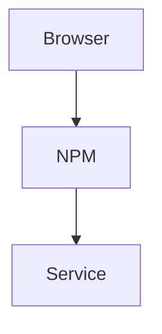

# MkDocs + Material — Homelab Docs Site

**Last Updated:** 2026-04-28
**Summary:** Self-hosted documentation site for homelab architecture, service docs, diagrams, and runbooks. Replaces the ad-hoc diagram embedded in the MCP dashboard.
**Host:** Babbage (TrueNAS SCALE) — `10.10.10.10`
**URL:** https://docs.home.timmcg.net

---

## Overview

MkDocs with the Material theme, running in Docker via a Dockge stack on Babbage. Serves Markdown docs + Mermaid diagrams as a static-style site with dark/light mode, full-text search, and code copy. Protected by Authentik SSO via NPM forward auth.

---

## Architecture

| Component | Detail |
|-----------|--------|
| Image | `squidfunk/mkdocs-material:latest` |
| Container | `mkdocs` |
| Port | host `18000` → container `8000` |
| Volume | `/mnt/Containers/MkDocs:/docs` |
| Command | `serve --dev-addr=0.0.0.0:8000` |
| Compose | `/mnt/Containers/MkDocs/compose.yaml` |
| Config | `/mnt/Containers/MkDocs/mkdocs.yml` |
| Docs root | `/mnt/Containers/MkDocs/docs/` |

---

## Services

| Service | URL | Direct |
|---------|-----|--------|
| Docs Site | https://docs.home.timmcg.net | http://10.10.10.10:18000 |

Proxied through NPM on Babbage. Authentik forward auth (Home Lab Global).

---

## Docs Structure

```
/mnt/Containers/MkDocs/
├── mkdocs.yml          — site config (nav, theme, extensions)
└── docs/
    ├── index.md        — homepage
    ├── infrastructure/ — network, DNS, servers, SSL
    ├── services/       — per-service docs
    └── diagrams/       — architecture.md (Mermaid + SVG embeds)
```

---

## Features Enabled

- **Material theme** — dark/light toggle, deep purple palette
- **Mermaid diagrams** — via `pymdownx.superfences` custom fence
- **Navigation tabs + sections** — top-level tabs for Infrastructure / Services / Diagrams
- **Search** — built-in full-text
- **Code copy** — one-click copy on all code blocks
- **Admonitions** — `!!! note`, `!!! warning`, etc.

---

## Adding / Editing Docs

1. Edit Markdown files under `/mnt/Containers/MkDocs/docs/` on Babbage directly, or via `scp` / SSH
2. MkDocs `serve` mode auto-reloads on file changes — no restart needed
3. Add new pages to the `nav:` section in `mkdocs.yml` to make them appear in the sidebar

### Adding a Mermaid diagram

````markdown

````

### Migrating diagrams from the MCP dashboard

The homelab architecture SVGs generated by `atlas-sync.py` can be embedded directly:
```markdown

```
Copy SVGs to `/mnt/Containers/MkDocs/docs/assets/` and link from `diagrams/architecture.md`.

---

## Operational Runbooks

### Restart container
```bash
ssh babbage "sudo docker restart mkdocs"
```

### View logs
```bash
ssh babbage "sudo docker logs mkdocs --tail 50"
```

### Update image
```bash
ssh babbage "sudo docker pull squidfunk/mkdocs-material:latest && sudo docker restart mkdocs"
```

### Check file permissions
```bash
ssh babbage "ls -lah /mnt/Containers/MkDocs/"
# Should be apps:docker
```

---

## Deployment History

- **2026-04-28:** Initial deployment. Dockge stack on Babbage, DNS + NPM + Authentik via `deploy_mkdocs.yml` playbook. Docs structure scaffolded with Infrastructure / Services / Diagrams sections. Homepage card added to `homelab-homepage`.
